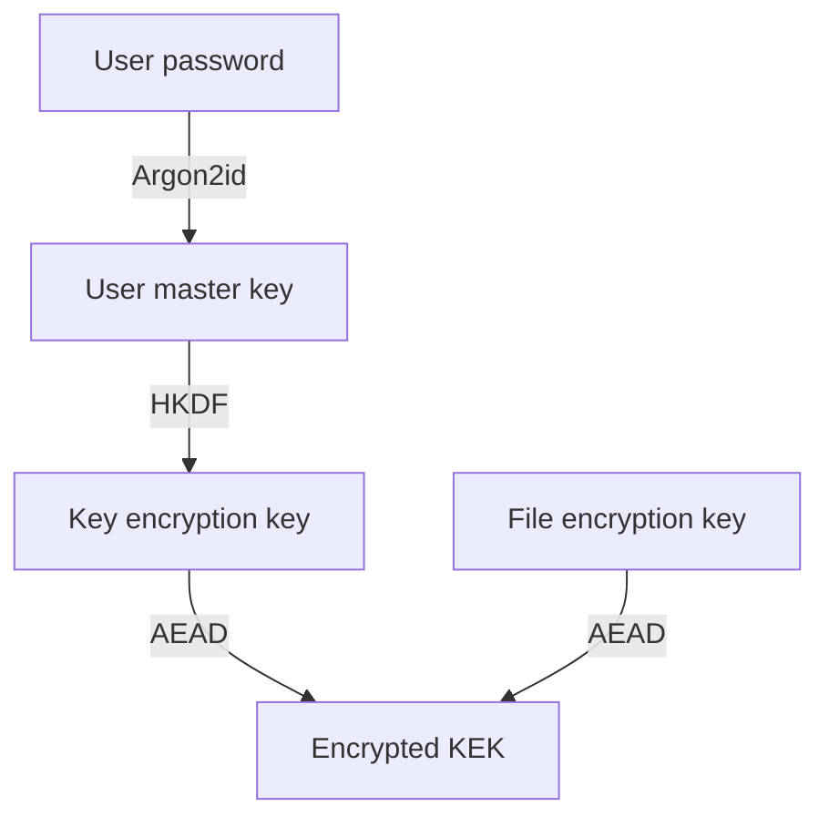
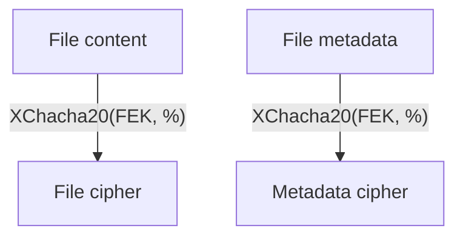
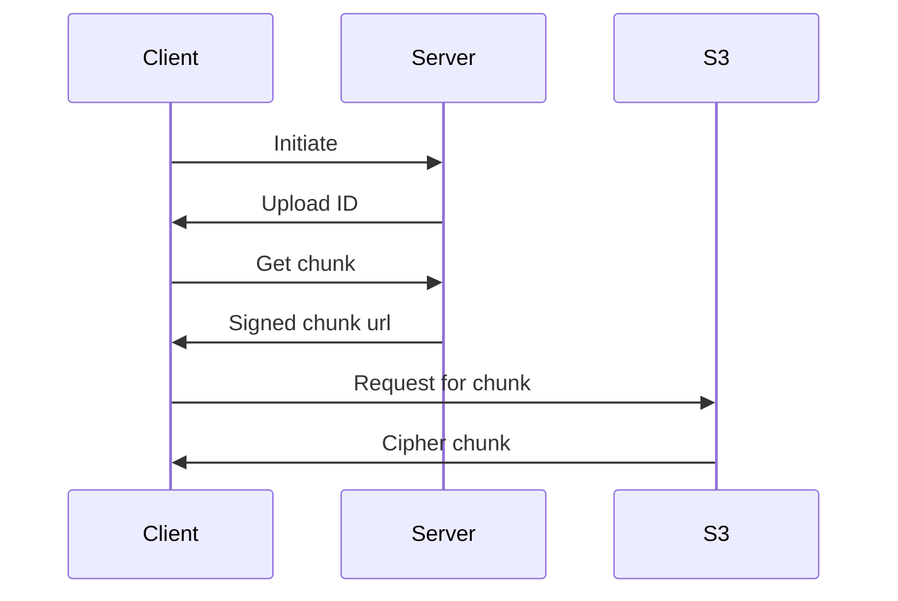

# Key Derivation


```mermaid
flowchart TB

pswd[User password]
umk[User master key]
fek[File encryption key]
kek[Key encryption key]
efek[Encrypted KEK]

pswd --Argon2id--> umk
umk --HKDF--> kek
kek --AEAD--> efek
fek --AEAD--> efek

```

# Data encryption


```mermaid
flowchart TB

file[File content]
meta[File metadata]
fc[File cipher]
mc[Metadata cipher]

file --XChacha20(FEK, %)--> fc
meta --XChacha20(FEK, %)--> mc
```

# Storage

```
[24B: Nonce] [...: Cipher]
```

# Upload


```mermaid
sequenceDiagram
    participant Client
    participant Server
    participant S3
    Client->>Server: Initiate
    Server->>Client: Upload ID
    Client->>Server: Get chunk
    Server->>Client: Signed chunk url
    Client->>S3: Request for chunk
    S3->>Client: Cipher chunk
```